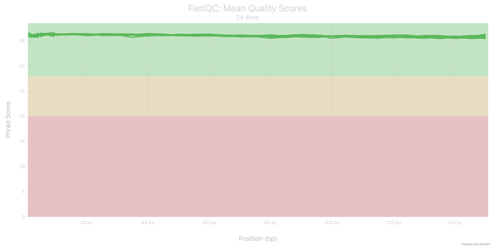
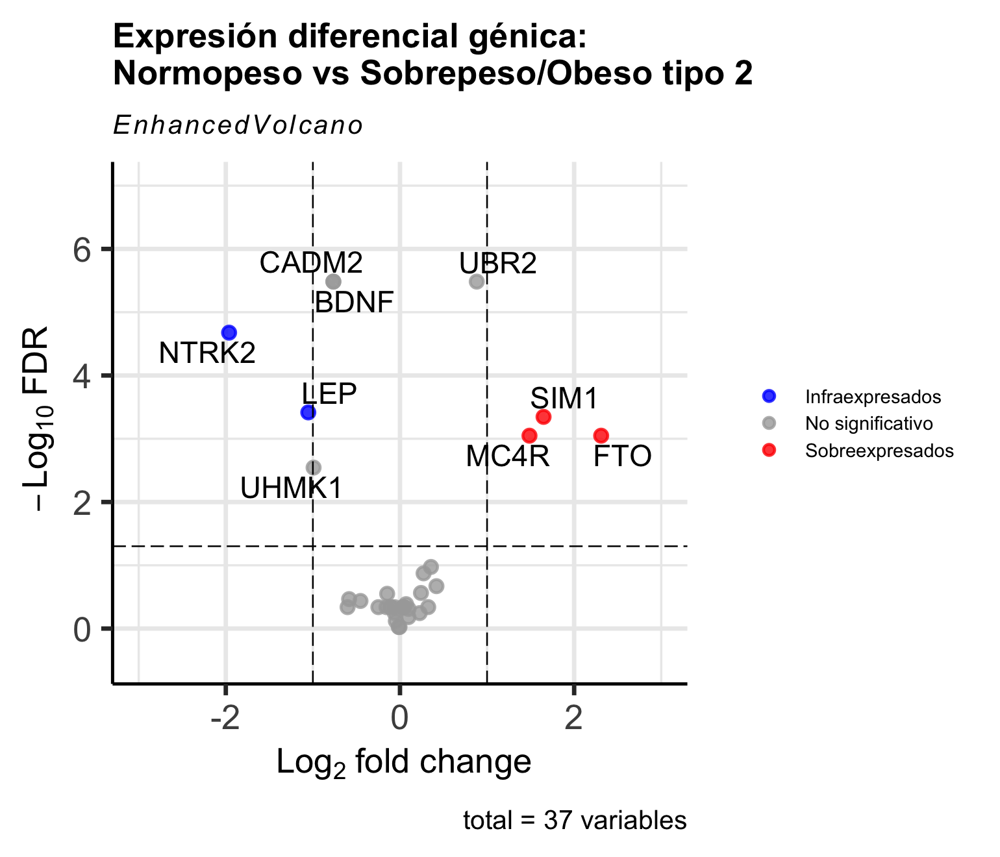
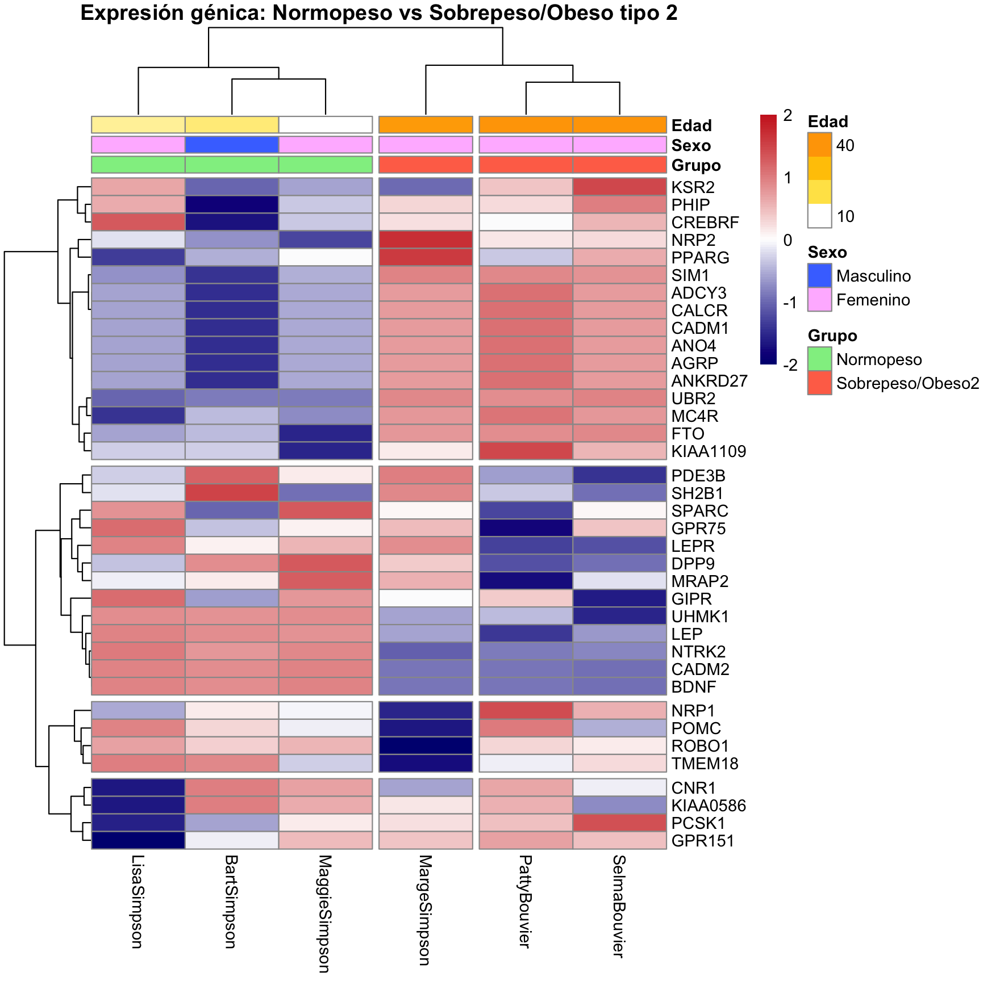

Este proyecto presenta un flujo de trabajo bioinformático completo para el análisis de expresión diferencial de genes (RNA-seq). El objetivo del estudio es identificar firmas transcriptómicas y marcadores moleculares alterados al comparar sujetos con Normopeso frente a sujetos con Sobrepeso Tipo 2.

Se ha implementado un pipeline en lenguajes bash y R que abarca desde el preprocesamiento de las librerías y generación de la matriz de conteos, la normalización de los conteos, la visualización avanzada de resultados y su identificación y significado biológico. Mediante el uso de modelos estadísticos (EdgeR), se detectaron genes clave asociados a la regulación metabólica (como FTO y LEP, entre otros), permitiendo caracterizar el perfil molecular distintivo del sobrepeso.

❗️ Este análisis se ha realizado a partir de un dataset de muestras simuladas generadas con fines puramente académicos y didácticos. Sin embargo, los resultados muestran coherencia biológica con la literatura científica sobre obesidad y metabolismo. El propósito principal de este repositorio es demostrar la competencia técnica en el manejo de flujos de trabajo de análisis transcriptómico.

### Objetivos de aprendizaje
 * Realizar un análisis de calidad y alineamiento de lecturas RNA-seq.
 * Cuantificar niveles de expresión génica y normalizar los datos.
 * Identificar genes diferencialmente expresados entre grupos de individuos.
 * Interpretar perfiles de expresión en función del fenotipo o condición.
 * Representar los resultados en un póster científico.

-------------------------------------------------------------------------------- 

El análisis se llevó a cabo utilizando R y paquetes especializados de Bioconductor:

- Normalización y Estadística: `edgeR` (Modelos lineales generalizados y filtrado TMM).
- Visualización de Calidad: `MA Plots` para evaluar la distribución log-fold change vs. abundancia.
- Volcano Plots: `EnhancedVolcano` para la identificación visual de genes Up y Down-regulated significativos.
- Clustering: `pheatmap` para mapas de calor con agrupamiento jerárquico (distancia de correlación y método Ward.D2).


# Análisis Rna-Seq

## Análisis de calidad de las secuencias

Para garantizar la reproducibilidad y el aislamiento de las dependencias del proyecto, se configuró inicialmente un entorno virtual mediante `Conda`. En este entorno se instalaron herramientas bioinformáticas esenciales a través del canal `bioconda`, incluyendo:

  * **FastQC**: para el control de calidad.
  
  * **Fastp**: para el filtrado y recorte de secuencias.
  
  * **MultiQC**: para la generación de informes complementarios.
  
Esta configuración asegura que todas las versiones del software sean compatibles y estables durante el análisis.

La primera etapa del flujo de trabajo consistió en una evaluación inicial de la calidad de las lecturas crudas (*raw reads*). Se ejecutó `FastQC` sobre todos los archivos `.fastq.gz` originales, utilizando procesamiento en paralelo para optimizar el tiempo de análisis. Los informes resultantes se almacenaron en el directorio `Quality/Raw`, permitiendo obtener una línea base sobre la presencia de adaptadores y la distribución de las puntuaciones de calidad Phred a lo largo de las lecturas.

Con el objetivo de evaluar la necesidad de un preprocesamiento, se realizó una prueba de filtrado y recorte (trimming) utilizando `Fastp` con parámetros estrictos (calidad media Phred $Q>30$). Sin embargo, tras realizar una segunda ronda de control de calidad sobre estas secuencias procesadas y contrastar los informes de `FastQC` originales frente a los filtrados, se observó que las muestras crudas ya poseían una calidad excepcional, careciendo de contaminación significativa por adaptadores o caídas significativas de calidad.

Ante estos resultados, se decidió que el proceso de recorte no aportaba una mejora sustancial en las secuencias y, por el contrario, conllevaba el riesgo de reducir información biológica potencialmente relevante. Por tanto, basándose en el principio de conservar la máxima integridad de los datos, no se aplicó el filtrado definitivo y se procedió a las etapas de alineamiento y cuantificación utilizando las *raw reads*, las cuales cumplían con los estándares de calidad requeridos para la cuantificación.

Finalmente, utilizamos `MultiQC` para volver a observar todos los resultados del análisis calidad juntos. Con ello, reafirmamos que la calidad inicial era muy buena y preferimos no descartar lecturas mediante filtrado para no arriesgarnos a borrar datos reales e importantes para el análisis.


### Interpretación detallada del análisis de calidad de las secuencias

Puedes consultar el <a href="multiqc_report.html" target="_blank">informe MultiQC completo aquí</a>

El panel general del informe (*General Statistics*) confirma una alta homogeneidad entre todas las muestras analizadas. Todas las muestras (Bart, Lisa, Maggie, Marge, Patty y Selma) presentan un recuento de ~1325 secuencias por muestra. Esta elevada profundidad permite la detección de genes con baja tasa de transcripción y aumenta la potencia estadística necesaria para validar las diferencias observadas.

Como se puede observar en la Figura 1, los valores de calidad media (*mean Q*) se mantienen en la "zona verde" (Phred > 30) desde el inicio hasta el final de las lecturas (~150 bp) en todas las muestras. Esto significa que la precisión en la identificación de cada nucleótido es superior al 99.9%, es decir, que la calidad de las secuencias es muy alta. 

En el caso de este proyecto, donde las secuencias fueron creadas artificialmente de manera computacional, tiene sentido que la calidad, las lecturas y todos los parámetros tengan tan buenos valores. A la vez, se entiende que debido a esto no se observe la degradación típica de calidad hacia el final de la lectura que suele obligar a realizar un paso de *trimming*, lo que justifica el uso de las secuencias de las lecturas crudas para el alineamiento posterior.

Respecto al porcentaje de GC, este se sitúa consistentemente entre el 45% y el 46%. Una distribución tan estrecha indica que no existen sesgos en la preparación de las librerías y que las muestras son comparables entre sí. También se observa un porcentaje de duplicación cercano al 0.5%, un valor excepcionalmente bajo.
El informe detecta la presencia significativa de secuencias contaminantes provenientes de adaptadores de secuenciación. Los niveles de contenido de adaptadores son menores al 1% en todas las muestras, manteniendose dentro de los estándares de calidad de FastQC (<5%).

Si este estudio fuera real, el uso de datos crudos cuando la calidad es óptima evitaría la pérdida innecesaria de información biológica que a veces ocurre durante el proceso de trimming excesivo. En general se acostumbra a filtrar para obtener mejor calidad de secuencia, pero la calidad inicial en este caso es muy buena y, por tanto, se ha decidido utilizar los datos crudos en vez de los filtrados para los análisis posteriores.



<details>
<summary> 👈🏼 **Click aquí para ver el código completo del Pipeline del análisis en Bash**</summary>
```{bash AnalisisCalidad, eval=FALSE}

#!/bin/bash

SECONDS=0
# Notas: tener instalada una distribucion de conda para poder ejecutar herramientas para el analisis
# Buenas practicas: ejecutar la ayuda de los programas para ver las opciones y sintaxis con programa
# -h o programa --help
# cambiamos el directorio a donde necesitemos y tengamos nuestros archivos
cd /The-Simpson_Analisis-RNAseq/Calidad_y_cuantificacion

# 1. Creamos un entorno en conda con sus programas para utilizarlos de manera segura y aislada de
# otros entornos
conda init
conda create -n CalidadSimpsons -c bioconda -c conda-forge -c defaults -c r fastqc fastp multiqc
echo "Conda env created\n"

conda env list # aqui veis las listas de entornos que teneis dentro de conda

# 2. Activamos el entorno que acabamos de crear, y automaticamente nos metemos dentro de el
conda activate CalidadSimpsons
echo "Conda env activated!\n"

# Con estos comandos se crea y activa el entorno y le instalamos los contenedores, que son gestores
# de paquetes (-c) bioconda, conda-forge, defaults y r. 
# Posteriormente le instala los programas:
# - fastqc para el control de calidad
# - fastp para filtrar por longitud y calidad de secuencias
# - multiqc para informes de fastqc multiples


# nos movemos a la carpeta contenedora de los fastq
cd ./Fastqs

# creamos las carpetas que vamos a necesitar
mkdir -p Quality/Raw Quality/Filtered Trimmed

#############################  Workflow quality control  #######################
# En Quality/Raw haremos los controles de calidad de cada uno de los crudos con FastQC
# y luego cada uno lo meteremos en Trimmed/ con lo que devuelva FastP (procesado y filtrado),
# finalmente meteremos en Quality/Filtered dependiendo de lo que devuelva fastqc sobre los archivos
# de Trimmed/
# Es decir, las secuencias que tienen la calidad que queremos, y que usaremos para los siguientes
# pasos (alineamiento, cuantif) son las secuencias que devuelve fastp en Trimmed/


# 3. Realizamos el control de calidad de todos los archivos con el programa FASTQC (-t es el n de
# hilos que ejecutara el programa)
fastqc *fastq.gz -o Quality/Raw/ -t 32

echo "Quality control done by fastqc, outputted in Quality/Raw\n"

# 4. Ejecutamos el filtrado de secuencias que queremos por calidad y longitud con FASTP para cada
# muestra con un bucle for
ls *fastq.gz | cut -d _ -f 1 | sort -u > muestras.txt
  # aqui metemos los nombres de las muestras en una lista para iterar sobre ello despues

for i in $(cat muestras.txt); do fastp --in1 $i*R1* --in2 $i*R2* \
--out1 Trimmed/$i"_R1_filtered.fastq.gz" --out2 Trimmed/$i"_R2_filtered.fastq.gz" \
--detect_adapter_for_pe --cut_front --cut_tail --cut_window_size 12 --cut_mean_quality 30 \
--length_required 35 --json Trimmed/$i.json --html Trimmed/$i.html --thread 32; done

echo "Filtering done by fastp. Output can be found in Trimmed/ \n"

# 5. Ejecutamos de nuevo un segundo control de calidad para corroborar que hemos realizado
# correctamente el filtrado
fastqc Trimmed/*fastq.gz -o Quality/Filtered/ --threads 32

echo "Second quality control to filter sequences done by fastqc. Outputted in Quality/Filtered/\n"

duration=$SECONDS
echo "$(($duration / 60)) minutes and $(($duration % 60)) seconds elapsed.\n"

# tambien podemos generar un informe resumen con los pasos que hemos hecho con multiqc, se aplica 
# directamente a la carpeta contenedora de todos los informes y el html lo deja en la misma Fastqs/
multiqc .

open multiqc_report.html

```


## Alineamiento y cuantificación de las secuencias ante un genoma de referencia

Para la etapa de cuantificación de la expresión génica utilizamos el programa Salmon, una herramienta que realiza pseudoalineamientos. A diferencia de los alineadores que buscan la posición exacta base por base, a Salmon le determina si una lectura es compatible con alguno de los transcritos de la referencia. Esta estrategia ofrece dos ventajas clave: una velocidad de procesamiento superior y la optimización del almacenamiento, ya que evita la generación de los pesados archivos intermedios .sam o .bam, entregando directamente las matrices de conteo necesarias para el análisis estadístico para herramientas como `edgeR`, `DESeq2` o `limma-voom`.

Antes de procesar las muestras, fue necesario configurar un entorno de Conda específico (`salmon_env`) para evitar incompatibilidades con otras librerías del entorno anterior.

El primer paso del flujo de trabajo consistió en indexar la referencia genómica (`Referencia.fasta`). Mediante el comando `salmon index`, con ello, el programa construye una estructura de datos eficiente (tablas hash y arrays de sufijos) que actúa como un índice de búsqueda rápida para poder contrastar todas las lecturas contra la referencia.

Una vez generado el índice, se procedió a la cuantificación masiva de las muestras *paired-end* mediante un bucle automatizado. Se utilizó el modo de `--validateMappings`, un algoritmo avanzado de Salmon que mejora la sensibilidad y precisión al verificar las asignaciones de las lecturas. Además, configuramos el parámetro `-l A` para que el software detectara automáticamente el tipo de librería utilizada durante la secuenciación, asegurando una interpretación correcta de las lecturas.

El resultado final de este proceso genera un directorio de resultados por cada muestra, conteniendo logs con información relevante como la tasa de mapeo (*mapping rate*) y, lo más importante, los archivos `quant.sf`. Estos archivos son los que contienen los conteos de lecturas brutos que son la entrada para el análisis de expresión diferencial posterior. Por último se generó un nuevo reporte de MultiQC, permitiendo visualizar las estadísticas de alineamiento y cuantificación.


### Interpretación del análisis de cuantificación y alineamiento de Salmon

Puedes consultar el <a href="multiqc_salmon.html" target="_blank">informe MultiQC de Salmon completo aquí</a>

El informe refleja una muy buena eficiencia de mapeo, lo que confirma que la decisión de utilizar los datos crudos fue acertada debido a la alta calidad de las bases.
Todas las muestras presentan una tasa de alineamiento (*mapping rate*) extremadamente alta, situándose en el 100%; de los fragmentos iniciales, todos han sido asignados a transcritos específicos. En estudios de RNA-seq, una tasa superior al 80% se considera de alta calidad y alcanzar casi el 99% es un resultado excepcional. Esto indica que la totalidad de las lecturas por muestra coinciden con secuencias del transcriptoma de referencia.

Además, esta cifra tan alta demuestra que la presencia de adaptadores (que vimos en el informe anterior) no impidió que Salmon identificara los genes correctamente. Esto pasa probablemente gracias a que su algoritmo de quasi-mapping ignora secuencias técnicas si la señal biológica es fuerte. 
El Compatible Fragment Ratio (CFR) también ha recibido un valor de 100%, lo cual indica que el número de fragmentos que Salmon esperaba observar coincide exactamente con lo que observó. Es un indicador de consistencia perfecta. Finalmente, el M Bias (*strand mapping bias*) muestra si hay un sesgo de mapeo (si Salmon prefiere mapear al principio o al final de la lectura). Un valor de 1.0 significa que no hay sesgo y por tanto que la cobertura es uniforme en todo el gen.

<details>
<summary> 👈🏼 **Click aquí para ver el código completo del Pipeline del alineamiento y cuantificación en Bash**</summary>
```{bash AlineamientoCuantif, eval=FALSE}
#!/bin/bash

# ------ Pipeline de pseudoalineamiento y cuantificacion con Salmon ------------
# 										      !!!!!!  ATENCION  !!!!!!
# Lo primero que hay que hacer es crear un nuevo entorno porque con el entorno del analisis hay incompatibilidades y el resultado sale mal.

conda create --name salmon_env 
conda activate salmon_env
conda install -c bioconda salmon

# Utilizamos Salmon porque lleva a cabo un pseudoalineamiento, realmente no nos importa tanto la
# posicion exacta base por base, sino solo saber si la lectura es compatible con alguno de los 
# transcritos de referencia que le pasemos.
# Ademas, Salmon no genera archivos .sam o .bam tipicos del mapeo, que son muy pesados, sino que 
# devuelve directamente la matriz de conteos de las lecturas.

############# Workflow Salmon #############
# Despues de instalar salmon, el workflow de alineamiento y cuantificacion es:
		# 1- indexar la referencia fasta
		# 2- quantificar los fastq contra el index

# 1- Indexar la referencia fasta
salmon index -t Referencia.fasta -i salmon_index
		# aqui utilizamos la herramienta index, pasandole el fasta que queremos que indexe con -t (de
		# transcrito)
		# y tenemos que indicarle con -i el repo de salida en el que va a sacarlo

# Salmon al ejecutar esto, crea una carpeta salmon_index con varios archivos de funcionamiento 
# interno entre los que se encuentra informacion sobre la secuencia, una tabla hash de k-meros,
# un array de sufijos para buscar subcadenas durante el mapeo, y metadatos sobre la secuencia y
# sobre el analisis (pej version del algoritmo). 


# 2- Cuantificar los fastq frente al index que ha creado salmon
cd .. #volvemos a la carpeta de /Calidad_y_cuantificacion/
mkdir quant_results
# creamos una carpeta donde guardar la cuantificacion

# con un bucle, quantificamos todas las muestras
for i in $(cat Fastqs/muestras.txt);
do 
	echo "Quantifying sample: ${i}"
	salmon quant -i salmon_index -l A \
		-1 Fastqs/${i}_R1.fastq.gz \
		-2 Fastqs/${i}_R2.fastq.gz \
		--validateMappings \
		-o quant_results/${i}_quant
	echo "Quantifying done"
done
	# -1 pide la primera lectura del paired-end
	# -2 pide la segunda lectura del paired-end
	# --validateMappings es una version mejorada del algoritmo interno
	# -o donde y como queremos que salga el output

# Salmon quant devolvera mensajes que tenemos que leer e interpretar, podemos buscar en la terminal
# con ctrl+f:
	# [info] mapping rate = % -> aqui deberiamos estar viendo porcentajes del orden de >70-80%. 
	# 	(en el trabajo no sale, puede que sea porque son datos artificiales)
	# [info] counted n total reads -> sirve para saber si tenemos datos suficientes para hacer la
	#   estadistica (la quantf en si)
	# [error] o [warning] -> siempre es importante leer

# Asi mismo, los archivos importantes que nos vamos a llevar a R para analizar su diff expresion van
# a ser los quant.sf

# finalmente podemos lanzar un multiqc con los archivos quant.sf para que lo explique todo en html
# pero para ello tenemos que cambiar de entorno porque ya no tenemos instalado multiqc aqui

conda deactivate
conda activate CalidadSimpsons

multiqc . -n multiqc_salmon

open multiqc_salmon.html

```

## Análisis de expresión diferencial con herramientas en R

Para determinar los cambios en el perfil transcriptómico asociados al sobrepeso, se llevó a cabo un análisis de expresión diferencial comparando el grupo de Normopeso frente al grupo de Sobrepeso/Obeso Tipo 2. 
Inicialmente, se exploraron tres de las herramientas más consolidadas en bioinformática: `DESeq2`, `limma-voom` y `edgeR`. Tras una evaluación de los estadísticos obtenidos con cada uno de las herramientas, concluímos en presentar el pipeline realizado con `edgeR` como análisis principal, pues observamos que los resultados se situaban en un balance intermedio entre los de `DESeq2` y `limma-voom`. Pueden encontrarse los pipelines de todas las herramientas en el repositorio dentro de `/RNAseq/Expresion_diferencial` en sus respectivas carpetas.


### Análisis de expresión diferencial génica con edgeR

El procesamiento de los datos comienza con la importación de las cuantificaciones generadas por Salmon. Utilizando el paquete `tximport()` y un archivo de anotación ("Transcrito_a_Gen.tsv") en el que se encuentran los códigos de los tránscritos asociados al símbolo del gen al que pertenecen para facilitar posteriormente la interpretación biológica.

Se construyó el objeto `DGEList` con la matriz de conteos proporcionada por Salmon y se aplicó una normalización mediante el método TMM (*Trimmed Mean of M-values*) con la función `calcNormFactors()`. Este paso es crítico para corregir sesgos como las diferencias en el tamaño de la librería, asegurando que las diferencias observadas se deban a efectos biológicos reales. El modelado estadístico se ajustó mediante el modelo lineal generalizado (GLM). Se estimó la dispersión mediante (`estimateDisp()`) para indicar la variabilidad biológica de los datos de RNA-seq. Para el test de hipótesis, se empleó el enfoque de *Quasi-Verosimilitud* (`glmQLFit()` y `glmQLFTest()`), que proporciona un control riguroso de errores tipo I.  

Se consideraron como genes diferencialmente expresados (DEGs) aquellos que cumplían con el siguiente criterio: una tasa de falsos descubrimientos (un p valor ajustado) de $FDR < 0.05$ y un cambio en la expresión de $LogFoldChange > 1$ en valor absoluto, es decir, genes que al menos duplican o reducen a la mitad su expresión en el grupo Obeso tipo 2 respecto del grupo Normopeso.


### Visualización de los resultados

La visualización global de los resultados se realizó mediante cuatro gráficos. Primero, un MA Plot generado por `plotMD()` que permite verificar la calidad de la normalización, mostrando una distribución equilibrada de la intensidad de señal. Segundo, se generó un Volcano Plot utilizando `EnhancedVolcano()`, que facilita la identificación rápida de los genes más relevantes biológica y estadísticamente (destacados en rojo y azul). Este gráfico permite etiquetar genes candidatos específicos que muestran una expresión diferencial significativa entre las condiciones de normopeso y sobrepeso tipo 2. Tercero, para examinar los patrones de expresión a nivel individual, se generó un mapa de calor construido con `pheatmap()` revelando agrupaciones de expresión por condición clínica. Finalmente, se generaron diagramas tipo *boxplot* para visualizar la distribución de los conteos (logCPM) de los genes con expresión génica significativa mostrado por tipo de condición.


<details>
<summary> 👈🏼 **Click aquí para ver el código completo del Pipeline del análisis de expresión diferencial en R**</summary>
```{r analisis DEG, eval=FALSE}
########## Analisis diferencial de expresion RNAseq con EdgeR ############
#Autora: Virginia Garcia-Loygorri

# Salmon’s main output is its quantification file. This file is a plain-text, tab-separated file with
# a single header line (which names all of the columns). This file is named quant.sf and appears at
# the top-level of Salmon’s output directory. The columns appear in the following order:
#         Name, Length, EffectiveLength, TPM, NumReads
# Each subsequent row describes a single quantification record. The columns have the following
# interpretation.
  # Name — This is the name of the target transcript provided in the input database (FASTA file).
  # Length — This is the length of the target transcript in nucleotides.
  # EffectiveLength — This is the computed effective length of the target transcript. It takes into
    # account all factors being modeled that will effect the probability of sampling fragments from
    # this transcript, including the fragment length distribution and sequence-specific and
    # gc-fragment bias (if they are being modeled).
  # TPM — This is salmon’s estimate of the relative abundance of this transcript in units of
    # Transcripts Per Million (TPM). TPM is the recommended relative abundance measure to use for
    # downstream analysis.
  # NumReads — This is salmon’s estimate of the number of reads mapping to each transcript that was 
    # quantified. It is an “estimate” insofar as it is the expected number of reads that have
    # originated from each transcript given the structure of the uniquely mapping and multi-mapping
    # reads and the relative abundance estimates for each transcript.

# Lo primero que hay que hacer es instalar EdgeR si no lo tenemos instalado
BiocManager::install("edgeR")
BiocManager::install("tximport")

library(limma)
library(edgeR)
library(dplyr)
library(tidyr)
library(tximport)
library(readr)


# Cargamos el diseño experimental y la traducción de los transcritos a genes
sample_info <- read.csv("Design.csv") #sirve para construir rutas a los resultados
tx2gene <- read_tsv("Transcrito_a_Gen.tsv", col_names = FALSE) 
#lee el tsv indicando que el archivo no tiene cabecera
# este paso es esencial porque salmon quantifica a nivel de transcrio pero los analisis bio se hacen
# a nivel de gen, es el puente entre transcriptomica y genomica.
# tx to gene (tx2gene) transcript to gene
colnames(tx2gene) <- c("TXNAME", "GENEID") 
# asigna nombres  por convencion, a las dos columnas de tx2gene con txname y geneid, sirve para que
# tximport pueda utilizarlo ya que necesita la primera columna de IDs de transcritos y la segunda
# de IDs de genes

# Definimos rutas a los ficheros de cuantificacion de Salmon
files <- file.path("quant_results", paste0(sample_info$Sample, "_quant"), "quant.sf") 
names(files) <- sample_info$Sample

# Leemos los datos de expresión con tximport, ojo, en design.csv hay que tener solo los que
# necesitamos o tximport va a fallar
txi <- tximport(files, type = "salmon", tx2gene = tx2gene)

# Exploración de la matriz
counts <- txi$counts
group <- factor(sample_info$Condition)
# Extrae la matriz de conteos por gen
# Esta matriz es:
#   La entrada directa a DESeq2, edgeR, etc.
#   La base de todo analisis diferencial


##### ----------------Edge R-----------------------

# ---------------------------------------
# Crear el objeto DGEList (guardar el conteo y asociarlo a las muestras)
# ---------------------------------------

y <- DGEList(counts=counts,group=group) 
# DGEList es el nucleo de edgeR aqui se guardan los conteos y se asocian las muestras con los grupos

# ---------------------------------------
# Filtrado de genes por expresion (esto se haria de normal pero nosotros no porque tenemos muy pocos)
# ---------------------------------------
# keep <- filterByExpr(y) # guardamos los que mas expresion tienen
# y <- y[keep,,keep.lib.sizes=FALSE]

# ---------------------------------------
# Normalizacion de los datos
# ---------------------------------------
y <- calcNormFactors(y)
# utilizamos esta funcion porque lo que queremos comparar es la expresion de cada gen entre
# diferentes muestras tenemos que normalizar porque EdgeR no lo hace:
# corregimos los datos para que las diferencias entre muestras reflejen verdaderos
# cambios biologicos y no por problemas tecnicos:
# En RNAseq cada muestra puede variar porque:
    # 1. tamaño de libreria: algunas muestras tienen mas lecturas que otras
    # 2. sesgo de composicion, si unos genes estan super expresados, los genes bajos aprece que 
      # tengan demasiado poco
    # 3. otros factores: diferencuas de preparacion de libreria, eficiencia de secuenciacion,
      # batch effects

# ---------------------------------------
# Definir el diseño estadistico: que vamos a comparar contra que
# ---------------------------------------
design <- model.matrix(~group) 
# esto modela expresion vs muestra, aqui se decide que comparacion biologica hacemos


# ---------------------------------------
# Estimar la dispersion
# ---------------------------------------
y <- estimateDisp(y, design)
  # edgeR modela los conteos con una binomial negativa y estima dispersion comun y 
  # dispersion por gen

# ---------------------------------------
# Ajustar el modelo y test estadistico
# ---------------------------------------
fit <- glmQLFit(y, design) 
qlf <- glmQLFTest(fit, coef = 2) 
# glmQFTestcompara los levels por la columna 2 (coef=2) es decir: Normopeso sera la base 
# y ver si los genes se sobreexpresan o no en Sobrepeso

# Guardamos todos los genes
results <- topTags(qlf, n = Inf)$table
 # -> logFC es el cambio de expr 
    #-- Positivo → mas expresado en la condicion de interes. Negativo → menos expresado
 # -> pvalue es la significacion
 # -> FDR es lo que se reporta (false discovery rate) proporcion esperada de falsos positivos
  # entre los genes significativos (Es un pval corregido). FDR < 0.05 es el estandar cientifico

deg <- results[results$FDR < 0.05 & abs(results$logFC) > 1, ]
degFDR <- results[results$FDR < 0.05, ]


# Resumen EdgeR ----------
#  Conteos → DGEList
#  Filtrado → quitar ruido
#  Normalización → hacer muestras comparables
#  Modelo → biología experimental
#  Dispersión → variabilidad real
#  Test → genes diferenciales


#------------------------- Visualizacion de datos -----------------------------

# ---------------------------------------
# Definir umbrales de significancia
# ---------------------------------------
FDR_threshold <- 0.05
logFC_threshold <- 1 #(significa que la expresion se duplica o se reduce a la mitad)

status <- decideTests(qlf, p.value = FDR_threshold)


# ------------------------------------------------------------------------------
#                                      MA plot
# ------------------------------------------------------------------------------
# 1. Generar el gráfico
# values=c(1, -1) indica que queremos colorear los que suben (1) y bajan (-1)
# col=c("blue", "red") asigna azul a los que bajan y rojo a los que suben (puedes cambiarlo)
plotMD(qlf, status = status, values = c(1, -1), col = c("red", "blue"),
       main = "MA Plot: Normopeso vs Sobrepeso tipo 2",
       hl.cex = 1.5, bg.cex = 1, legend=FALSE) # Tamaño de los puntos resaltados
# 2. Añadir leyenda (opcional pero recomendado)
legend("topleft", legend=c("Sobreexpresado", "Infraexpresado", "No significativo"),
       col=c("red", "blue", "black"), pch=16, cex=0.8, bty = "n")

# 3. (Opcional) Añadir líneas horizontales en logFC 0
abline(h=0, col="gray", lty=2)
abline(h=1, col="black", lty=2)
abline(h=-1, col="black", lty=2)

genes_candidatos <- results[abs(results$logFC) > 0.7, ]

ajuste_y <- ifelse(rownames(genes_candidatos) == "BDNF", 0.2, 0)
# 4. Pintamos las etiquetas limpias
text(x = genes_candidatos$logCPM, 
     y = genes_candidatos$logFC + ajuste_y, 
     labels = rownames(genes_candidatos), 
     cex = 0.8,   # Tamaño letra
     pos = 1, 
     col = "black")


#------------------------------------------------------------------------------
#                                 VOLCANO PLOT
#------------------------------------------------------------------------------
library(EnhancedVolcano)
library(ggplot2)
library(ggrepel)

# --- PASO 1: DEFINIR LOS COLORES (Crear el objeto 'keyvals') ---

# Primero ponemos todo en negro ('NS' = No Significativo)
keyvals <- rep('darkgrey', nrow(results))
names(keyvals) <- rep('No significativo', nrow(results))

# Pintamos de ROJO los que suben (logFC > 1 y FDR < 0.05)
# Asegúrate de que tus columnas se llaman logFC y FDR
keyvals[which(results$logFC > 1 & results$FDR < 0.05)] <- 'red'
names(keyvals)[which(results$logFC > 1 & results$FDR < 0.05)] <- 'Sobreexpresados'

# Pintamos de AZUL los que bajan (logFC < -1 y FDR < 0.05)
keyvals[which(results$logFC < -1 & results$FDR < 0.05)] <- 'blue'
names(keyvals)[which(results$logFC < -1 & results$FDR < 0.05)] <- 'Infraexpresados'

genes_significativos <- rownames(results)[which(names(keyvals) %in% 
                                                  c('Sobreexpresados', 'Infraexpresados'))]
genes_limite <- rownames(results)[which(results$FDR < 0.05)]

EnhancedVolcano(results,
                title = "Expresión diferencial génica: \nNormopeso vs Sobrepeso/Obeso tipo 2",
                lab = rownames(results),
                x = "logFC",
                y = "FDR",
                ylim = c(-0.5, 7),
                xlim = c(-3, 3),
                selectLab = unique(c(genes_significativos, genes_limite)), # solo significativos
                xlab = bquote(~Log[2]~ 'fold change'),
                ylab = bquote(~-Log[10]~ "FDR"),
                pCutoff = 0.05,
                FCcutoff = 1,
                pointSize = 2.5,
                labSize = 5.5,
                colCustom = keyvals,
                colAlpha = 0.8,
                legendPosition = 'right',
                legendLabSize = 10,
                legendIconSize = 2,
                drawConnectors = TRUE,    # Activa las líneas conectoras
                widthConnectors = 0.01,    # Grosor de la línea
                colConnectors = "white", # Color de la línea (blanco)
                arrowheads = FALSE
                )


#-----------------------------------------------------------
#-----------------------    PHEATMAP     -------------------
#-----------------------------------------------------------
library(pheatmap)
# 1. Calculamos los logCPM de TODAS tus muestras
# Usamos el objeto 'qlf' o 'y' (tu objeto DGEList original)
logCPM <- cpm(y, log=TRUE)

# 2. Seleccionamos solo los Mejores Genes
# No podemos pintar 20,000 genes, así que cogemos los Top 30 o 50 de tu tabla de resultados
# Ordenamos por FDR (los más significativos primero)
nombres_genes <- rownames(results)[order(results$FDR)]

# 3. Recortamos la matriz: Nos quedamos solo con las filas de esos genes top
matriz_heatmap <- logCPM[nombres_genes, ]

# 4. Crear la tabla de anotaciones (la leyenda de las columnas)
# Asegúrate de que 'qlf$samples$group' existe. Si no, usa tu vector de grupos original.
anotaciones_muestras <- data.frame(Grupo = y$samples$group, Sexo = sample_info$Sexo,
                                   Edad = sample_info$Edad)

# Importante: Los nombres de fila de esta tabla deben coincidir con las columnas del heatmap
rownames(anotaciones_muestras) <- colnames(matriz_heatmap)

# 5. Definir colores bonitos para los grupos
colores_anotacion <- list(
  Grupo = c(Normopeso = "lightgreen", "Sobrepeso/Obeso2" = "coral1"),
  Sexo = c(Masculino = "royalblue1", Femenino = "plum1"),
  Edad = c("white", "gold", "orange")
)

# 6. Pintar el Heatmap CON la barra de grupos
pheatmap(matriz_heatmap,
         scale = "row",
         annotation_col = anotaciones_muestras, # Añadimos la barra
         annotation_colors = colores_anotacion, # Añadimos los colores
         cluster_rows = TRUE,
         cluster_cols = TRUE,
         cutree_rows = 4,  # Corta el árbol de genes en 2 bloques (Suben vs Bajan)
         cutree_cols = 3,
         clustering_method = "ward.D2",
         main = "Expresión génica: Normopeso vs Sobrepeso/Obeso tipo 2",
         color = colorRampPalette(c("navy", "white", "firebrick3"))(100)
)


#-------------------------------------------------------------------------------
#-----------------------               BOXPLOTS              -------------------
#-------------------------------------------------------------------------------

library(ggplot2)
library(reshape2)


# 1. Seleccionamos los genes que queremos pintar
# Opción A: Los 6 más significativos automáticamente


# Opción B: Tus favoritos manuales (si prefieres estos, descomenta la línea)
# genes_a_pintar <- c("FTO", "LEP", "INS", "MC4R")

# 2. Extraemos sus valores de expresión (logCPM)
# Usamos t() para transponer: queremos que las columnas sean los genes
genes_boxplot <- t(cpm(y, log=TRUE)[rownames(results)[((results$logFC > 1 | results$logFC < -1) &
                                                         results$FDR < 0.05)], ])
genes_boxplot <- as.data.frame(genes_boxplot)

# 3. Añadimos la columna del Grupo
# Asegúrate de que 'qlf$samples$group' es donde tienes "Normopeso/Sobrepeso"
genes_boxplot$Grupo <- y$samples$group

# 4. Transformamos a formato largo
# Esto crea una tabla con 3 columnas: Grupo, Gen, y LogCPM
datos_largos <- melt(genes_boxplot, 
                     id.vars = "Grupo", 
                     variable.name = "Gen", 
                     value.name = "LogCPM")

# Pequeña limpieza: asegurar que el Grupo es un factor (para los colores)
datos_largos$Grupo <- as.factor(datos_largos$Grupo)
ggplot(datos_largos, aes(x = Grupo, y = LogCPM, fill = Grupo)) +
  
  # 1. El diagrama de caja (sin outliers negros, porque pondremos los puntos reales)
  geom_boxplot(alpha = 0.7, outlier.shape = NA) + 
  
  # 2. Los puntos individuales (Jitter)
  geom_jitter(position = position_jitter(width = 0.2), 
              size = 2, 
              alpha = 0.6) +
  
  # 3. Dividir en una rejilla (un gráfico por gen)
  facet_wrap(~Gen, scales = "free_y") + 
  
  # 4. Colores personalizados (Iguales a tu Heatmap)
  scale_fill_manual(values = c("Normopeso" = "lightgreen", 
                               "Sobrepeso/Obeso2" = "coral1")) + # ¡Revisa tus nombres exactos!
  
  # 5. Estética limpia
  theme_minimal() +
  labs(title = "Expresión de genes diferencialmente significativos \ncon umbral FC > 1 o FC < -1",
       y = "LogCPM (Expresión)",
       x = "") +
  theme(legend.position = "none", # Quitamos leyenda porque ya está en el eje X
        strip.text = element_text(face = "bold", size = 12), # Títulos de los genes grandes
        axis.text.x = element_text(angle = 45, hjust = 1))   # Inclinar texto eje X si es largo

```

### Interpretación de los resultados


  -> interpretación maplot
 


  -> interpretación volcano plot
  


  -> interpretación del heatmap
  
## Análisis de enriquecimiento funcional de los genes diferencialmente expresados

El enriquecimiento funcional es la técnica que permite dar un contexto biológico a la lista de genes diferencialmente expresados que hemos obtenido, agrupándolos según las funciones o rutas en las que participan. Gracias a este análisis, podemos ver si hay procesos biológicos o vías de señalización que están estadísticamente sobrerrepresentadas, lo que nos ayuda a entender qué está ocurriendo realmente a nivel molecular en las muestras.

Para ello, se parte de los resultados obtenidos con EdgeR para los genes diferencialmente expresados con un $FDR<0.05$ y con un cambio de expresión relevante ($FC}≥1$). Se utilizó la librería `gprofiler2` a través de internet, cruzando los genes con bases de datos clave: 

* GO:BP -> Gene Ontology (Biological Process) 

* KEGG -> Kyoto Encyclopedia of Genes and Genomes

* Reactome -> Reactome pathway database

* WP -> WikiPathways

* HPA -> Human Protein Athlas

* HP -> Human Phenotype ontology

Con `gprofiler2` se obtiene un gráfico interactivo que indica las rutas metabólicas o funciones en las que están implicados los genes proporcionados como entrada, clasificadas por la base de datos de la que se han obtenido.

Para ver en detalle de todos los términos enriquecidos, puedes consultar el
<a href="EnriquecimientoPlot.html" target="_blank">gráfico interactivo completo aquí</a>.


Así mismo, hemos generado una tabla interactiva creada con el paquete `reactable` que presenta de forma detallada los resultados estadísticos del enriquecimiento. La tabla estructura la información en cinco columnas: la Base de Datos de origen de la salida, el identificador (ID) y la descripción del término biológico, el P-Value ajustado y el Nº de Genes (intersection size), que indica cuántos genes de los diferencialmente expresados están involucrados en ese proceso específico.

Una herramienta útil en la visualización de esta tabla interactiva es el ordenamiento interactivo: al hacer clic sobre el encabezado de cualquiera de las columnas, los datos se reorganizan. Por ejemplo, pinchando sobre "P-Value Adj", se puede reordenar los términos de mayor a menor significancia (ascendente o descendente), lo mismo ocurre con el "Nº de Genes" si queremos priorizar las rutas con más hits. Además, la tabla incluye un buscador integrado para localizar términos concretos, paginación y un resaltado visual (highlight) que marca la fila sobre la que se sitúa el ratón, facilitando el seguimiento de la lectura.

Para ver el detalle de todos los términos enriquecidos, puedes consultar la 
<a href="tablaEnriquecimiento.html" target="_blank">tabla interactiva completa aquí</a>.

<details>
<summary> 👈🏼 **Click aquí para ver el código completo del Pipeline del análisis de enriquecimiento funcional en R**</summary>
```{r enriquecimiento, eval=FALSE}
#--------------------------------- Enriquecimiento ------------------------------------
# Autora: Virginia Garcia-Loygorri

#########################       Enriquecimiento       ##############################
# Carga de datos de edgeR para tratar con ellos
genes_DEG <- readRDS("../Expresion_diferencial/EdgeR/degFDR.rds")

# Cargamos librerias para enriquecimiento ! Con acceso a internet
library(gprofiler2)
library(plotly)


gost_data <- gost(query = list(" " = row.names(genes_DEG[genes_DEG$FDR < 0.05
                                                         & abs(genes_DEG$logFC) >= 1, ])), 
                 organism = "hsapiens", 
                 ordered_query = FALSE,
                 correction_method = "fdr",
                 sources = c("GO:BP", "KEGG", "REAC", "WP", "HPA", "HP"),
                 significant = TRUE)

# Generar el plot interactivo
p_interactivo <- gostplot(gost_data, interactive = TRUE)

# Personalizacion del plot
layout(p_interactivo,
       title = "\n\nAnálisis de enriquecimiento funcional de los genes expresados diferencialmente",
       xaxis = list(title = "Bases de Datos"))


#########################       Tabla de enrich       ##############################

gost_table <- gost_data$result[, c("source", "term_id", "term_name", "p_value", "intersection_size")]
#Cogemos los valores del enriquecimiento de gost que nos interesan

library(reactable) #libreria para tabla interactiva

reactable(
  gost_table,
  columns = list(
    source = colDef(name = "Base de Datos", width = 100, align = "center"),
    term_id = colDef(name = "ID", width = 120, align = "center"),
    term_name = colDef(name = "Descripción del Término", minWidth = 200, align = "center"),
    p_value = colDef(name = "P-Value Adj", align = "center", cell = function(value) {
      formatC(value, format = "e", digits = 3) }
      ),
    intersection_size = colDef(name = "Nº Genes", align = "center")
    ),
  pagination = TRUE,
  showPagination = TRUE,
  showPageInfo = TRUE,
  sortable = TRUE,
  searchable = TRUE,      # Barra de búsqueda
  striped = TRUE,         # Filas a rayas
  highlight = TRUE,       # Resalta al pasar el ratón
  bordered = TRUE,
  defaultPageSize = 15,   # Paginación
  theme = reactableTheme(
    style = list(fontFamily = "Helvetica, sans_serif",
    fontSize = "14px"),
    borderColor = "black",
    stripedColor = "#D5DBDE",
    highlightColor = "#C4E4F5",
    cellPadding = "8px 12px",
    headerStyle = list(
      fontWeight = "bold",
      backgroundColor = "#f0f0f0"
    )
  )
)
```


